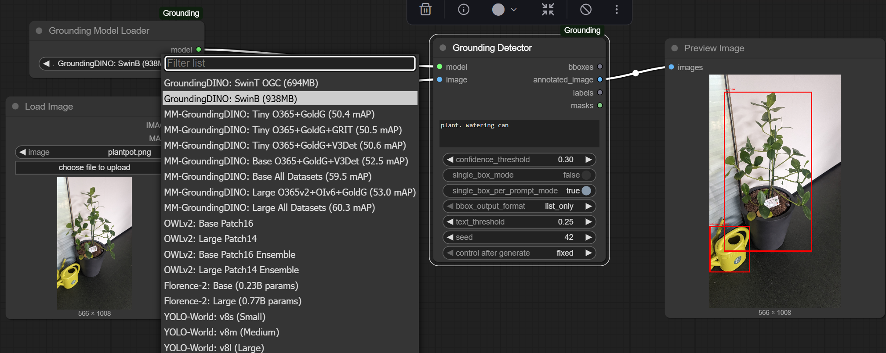
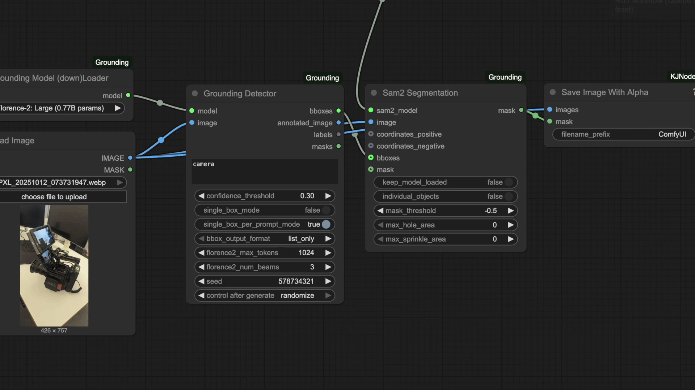
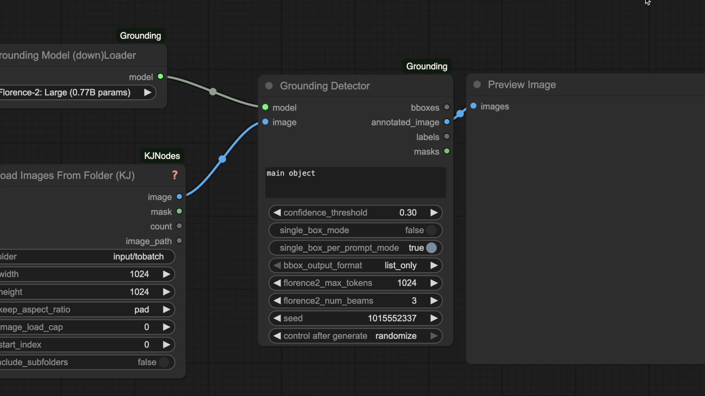

# ComfyUI-Grounding

**Grounding toolbox**

🎯 **8 Nodes Total** - 2 Loaders + 2 Detectors + 2 SAM2 + 2 Utilities

🚀 **6 Model Families** - GroundingDINO, MM-GroundingDINO, OWLv2, Florence-2, YOLO-World, SA2VA

🤖 **33 Models** - 19 bbox detection + 6 mask generation + 8 SAM2 variants

💾 **Smart Caching** - Instant reload

📦 **Batch Processing** - Multiple images at once

🎭 **Built-in Masks** - No separate BboxToMask node needed

## Visual Demos

### Model Switching
Switch between 19+ detection models with a single dropdown. One node for everything.

### SA2VA Vision-Language Segmentation
When Florence2 isn't enough. Sa2va has VERY advanced semantic understanding and reasoning capabilities.

### SAM2 Support

### Batch Processing
Process multiple images simultaneously with all nodes supporting batch operations.

### Label Splitting Logic
Control label separation: use periods for multiple labels, commas for single compound labels.

## Installation

**On first ComfyUI startup:**
- Example assets auto-copied to `ComfyUI/input/`
- Example workflows auto-copied to user workflows with "ComfyUI-Grounding_" prefix

## The Nodes

### Detection Nodes

#### 1. Grounding Model (down)Loader
Load any of 15+ models from a single dropdown. See footnotes for full list

#### 2. Grounding Detector
Universal detector for all models with bbox/mask output.

#### Key Features

- Overrides standard text label splitting. It splits only at ".", otherwise label is what you write
- Enable `single_box_mode` for single detection
- First load: Downloads model
- Second load: Instant from cache
- Models stored in ComfyUI standard folders:
  - GroundingDINO → `models/grounding-dino/`
  - Florence-2 & OWLv2 → `models/LLM/`
  - YOLO-World → `models/yolo_world/`
  - SAM2 → `models/sam2/`
- Process multiple images in one pass
- All nodes support batches

### Mask Generation Nodes

#### 3. Grounding Mask (down)Loader

Load mask generation models:

**Florence-2 Segmentation (2 models)**
- Direct segmentation masks from text prompts

**SA2VA Vision-Language (4 models)**
- Visual grounding with advanced semantic understanding
- Requires `trust_remote_code=True`
- Supports fp16/bf16/fp32 precision options

#### 4. Grounding Mask Detector

Direct mask generation from text prompts. Outputs masks, overlaid images, and generated text descriptions.

### SAM2 Segmentation Nodes

#### 5. SAM2 Model (down)Loader

Load SAM2 models for high-quality segmentation:

**SAM2/2.1 (4 variants)**

Auto-downloads from HuggingFace (Kijai/sam2-safetensors) if not found locally.
Supports fp16/bf16/fp32 precision and 3 segmentor modes: single_image, video, automaskgenerator.

#### 6. SAM2 Segment

Segment using bboxes from grounding models or point coordinates.
- Supports batch processing
- Models cached in memory for instant reload
- Compatible with all grounding model outputs

### Utility Nodes

#### 7. Bounding Box Visualizer

Re-draw bboxes on images with custom line width. Optional since detector already returns annotated images.

#### 8. Batch Crop and Pad From Mask

Crops images to mask bounding boxes and pads them to uniform size for batch processing.

## Example Workflows

Three ready-to-use workflows in `/workflows/`:

- **normal_grounding.json** - Object detection + SAM2 segmentation pipeline
- **batch_normal_grounding.json** - Batch version for processing multiple images
- **mask_grounding.json** - Direct mask generation using SA2VA (faster for segmentation)

Load these in ComfyUI to see the nodes in action.

## Advanced Features

**Detection Modes:**
- `single_box_mode` - Returns only highest-scoring detection (useful for referring expressions)
- `single_box_per_prompt_mode` - Returns best detection per label

**Output Formats:**
- `list_only` - Simple bbox list (SAM2-compatible)
- `dict_with_data` - Includes labels and confidence scores

**Smart Caching:**
- Models cached in memory after first load
- Instant reload on subsequent uses
- Cache key includes model type and configuration

## Credits

- [GroundingDINO](https://github.com/IDEA-Research/GroundingDINO) - IDEA-Research
- [OWLv2](https://huggingface.co/google/owlv2-base-patch16) - Google Research
- [Florence-2](https://huggingface.co/microsoft/Florence-2-base) - Microsoft Research
- [YOLO-World](https://github.com/ultralytics/ultralytics) - Ultralytics

## License

MIT License

## Footnotes
Full list of models:

  1. GroundingDINO: SwinT OGC (694MB) - IDEA-Research/grounding-dino-tiny
  2. GroundingDINO: SwinB (938MB) - IDEA-Research/grounding-dino-base
  3. MM-GroundingDINO: Tiny O365+GoldG (50.4 mAP) - openmmlab-community/mm_grounding_dino_tiny_o365v1_goldg
  4. MM-GroundingDINO: Tiny O365+GoldG+GRIT (50.5 mAP) - openmmlab-community/mm_grounding_dino_tiny_o365v1_goldg_grit
  5. MM-GroundingDINO: Tiny O365+GoldG+V3Det (50.6 mAP) - openmmlab-community/mm_grounding_dino_tiny_o365v1_goldg_v3det
  6. MM-GroundingDINO: Base O365+GoldG+V3Det (52.5 mAP) - openmmlab-community/mm_grounding_dino_base_o365v1_goldg_v3det
  7. MM-GroundingDINO: Base All Datasets (59.5 mAP) - openmmlab-community/mm_grounding_dino_base_all
  8. MM-GroundingDINO: Large O365v2+OIv6+GoldG (53.0 mAP) - openmmlab-community/mm_grounding_dino_large_o365v2_oiv6_goldg
  9. MM-GroundingDINO: Large All Datasets (60.3 mAP) - openmmlab-community/mm_grounding_dino_large_all
  10. OWLv2: Base Patch16 - google/owlv2-base-patch16
  11. OWLv2: Large Patch14 - google/owlv2-large-patch14
  12. OWLv2: Base Patch16 Ensemble - google/owlv2-base-patch16-ensemble
  13. OWLv2: Large Patch14 Ensemble - google/owlv2-large-patch14-ensemble
  14. Florence-2: Base (0.23B params) - microsoft/Florence-2-base
  15. Florence-2: Large (0.77B params) - microsoft/Florence-2-large
  16. YOLO-World: v8s (Small) - yolov8s-worldv2.pt
  17. YOLO-World: v8m (Medium) - yolov8m-worldv2.pt
  18. YOLO-World: v8l (Large) - yolov8l-worldv2.pt
  19. YOLO-World: v8x (Extra Large) - yolov8x-worldv2.pt

