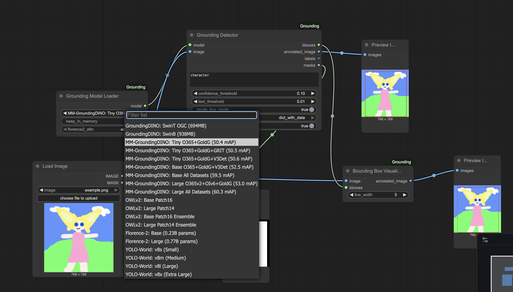

# ComfyUI-Grounding

**Grounding toolbox**



🎯 **8 Nodes Total** - 2 Loaders + 2 Detectors + 2 SAM2 + 2 Utilities

🚀 **6 Model Families** - GroundingDINO, MM-GroundingDINO, OWLv2, Florence-2, YOLO-World, SA2VA

🤖 **33 Models** - 19 bbox detection + 6 mask generation + 8 SAM2 variants

💾 **Smart Caching** - Instant reload

📦 **Batch Processing** - Multiple images at once

🎭 **Built-in Masks** - No separate BboxToMask node needed

## Visual Demos

### Model Switching
Switch between 19+ detection models with a single dropdown. One node for everything.


### SA2VA Vision-Language Segmentation
When Florence2 isn't enough. Sa2va has VERY advanced semantic understanding and reasoning capabilities.


### SAM2 Support


### Batch Processing
Process multiple images simultaneously with all nodes supporting batch operations.


### Label Splitting Logic
Control label separation: use periods for multiple labels, commas for single compound labels.


## Installation

```bash
cd ComfyUI/custom_nodes/
git clone https://github.com/PozzettiAndrea/ComfyUI-Grounding
cd ComfyUI-Grounding
pip install -r requirements.txt
```

On first startup, example assets and workflows are auto-installed.

## The Nodes

### Detection Nodes
**1. Grounding Model Loader** - 19+ models in dropdown (see footnotes)

**2. Grounding Detector** - Universal detector, splits labels on "." only

### Mask Generation Nodes
**3. Grounding Mask Loader** - Florence-2 (2) + SA2VA (4) models

**4. Grounding Mask Detector** - Direct masks from text, outputs masks + overlays + descriptions

### SAM2 Segmentation Nodes
**5. SAM2 Model Loader** - SAM2/2.1 (8 variants), auto-downloads, fp16/bf16/fp32

**6. SAM2 Segment** - Segment from bboxes or points

### Utility Nodes
**7. Bounding Box Visualizer** - Custom line width

**8. Batch Crop and Pad** - Uniform sizing for batches

## Example Workflows

- **normal_grounding.json** - Detection + SAM2 segmentation
- **batch_normal_grounding.json** - Multi-image processing
- **mask_grounding.json** - Direct SA2VA masking

## Advanced Features

**Detection modes:** `single_box_mode` (top result only) • `single_box_per_prompt_mode` (best per label)
**Output formats:** `list_only` (SAM2-compatible) • `dict_with_data` (with labels/scores)
**Prompt format:** Use periods for multiple labels `"dog. cat."` • Use commas for single label `"small, brown dog"`

## Credits

- [GroundingDINO](https://github.com/IDEA-Research/GroundingDINO) - IDEA-Research
- [OWLv2](https://huggingface.co/google/owlv2-base-patch16) - Google Research
- [Florence-2](https://huggingface.co/microsoft/Florence-2-base) - Microsoft Research
- [YOLO-World](https://github.com/ultralytics/ultralytics) - Ultralytics

## License

MIT License

## Footnotes
Full list of models:

<div style="font-size: 0.75em; line-height: 1.4;">

  1. GroundingDINO: SwinT OGC (694MB) - IDEA-Research/grounding-dino-tiny
  2. GroundingDINO: SwinB (938MB) - IDEA-Research/grounding-dino-base
  3. MM-GroundingDINO: Tiny O365+GoldG (50.4 mAP) - openmmlab-community/mm_grounding_dino_tiny_o365v1_goldg
  4. MM-GroundingDINO: Tiny O365+GoldG+GRIT (50.5 mAP) - openmmlab-community/mm_grounding_dino_tiny_o365v1_goldg_grit
  5. MM-GroundingDINO: Tiny O365+GoldG+V3Det (50.6 mAP) - openmmlab-community/mm_grounding_dino_tiny_o365v1_goldg_v3det
  6. MM-GroundingDINO: Base O365+GoldG+V3Det (52.5 mAP) - openmmlab-community/mm_grounding_dino_base_o365v1_goldg_v3det
  7. MM-GroundingDINO: Base All Datasets (59.5 mAP) - openmmlab-community/mm_grounding_dino_base_all
  8. MM-GroundingDINO: Large O365v2+OIv6+GoldG (53.0 mAP) - openmmlab-community/mm_grounding_dino_large_o365v2_oiv6_goldg
  9. MM-GroundingDINO: Large All Datasets (60.3 mAP) - openmmlab-community/mm_grounding_dino_large_all
  10. OWLv2: Base Patch16 - google/owlv2-base-patch16
  11. OWLv2: Large Patch14 - google/owlv2-large-patch14
  12. OWLv2: Base Patch16 Ensemble - google/owlv2-base-patch16-ensemble
  13. OWLv2: Large Patch14 Ensemble - google/owlv2-large-patch14-ensemble
  14. Florence-2: Base (0.23B params) - microsoft/Florence-2-base
  15. Florence-2: Large (0.77B params) - microsoft/Florence-2-large
  16. YOLO-World: v8s (Small) - yolov8s-worldv2.pt
  17. YOLO-World: v8m (Medium) - yolov8m-worldv2.pt
  18. YOLO-World: v8l (Large) - yolov8l-worldv2.pt
  19. YOLO-World: v8x (Extra Large) - yolov8x-worldv2.pt
</div>